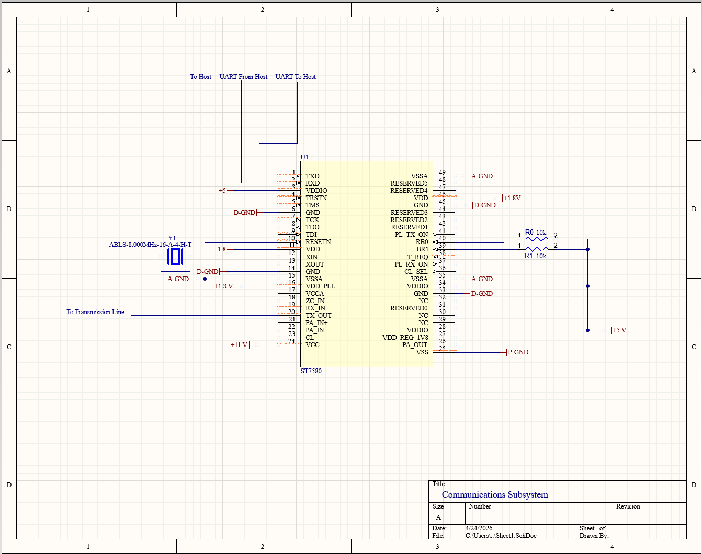

# Communications Detailed Design

**NOTE:** Other subsystems call the two parts "transmitter" and receiver, but since both parts transmit and receive, in this document, they will be called "server" and "client" respectively. The "external host" refers to either the coincidence unit or detector.

## Function of the Subsystem

Siemens, the customer, will need to receive status updates from the detectors, and ideally, this can be incorporated with the power and clock in the single transmission line. The communications subsystem has two identical parts, the server and client. Both parts work in tandem to transmit and receive a debug signal across the line. This system must be able to take any data input and transform it into a modulated packet to receive that data input on the opposite end. [1] 

## Specifications and Constraints

### Specifications Requested by Siemens
The most basic requirements of this system are as follows: The system must receive a generic data signal, modulate it, transmit it, then the other part must do the reverse steps to extract the data signal again. Both parts must serve transmitter and receiver roles. Since integration into the coincidence unit and detectors is not within our responsibility, the subsystem must be able to modulate any generic bit stream. [1]

### FCC Part 15

FCC part 15 Section 113 states that "signals from this operation shall be contained within the frequency band 9 kHz to 490 kHz" [2]. The document provided by Siemens suggests a bitrate of 500kbps to 1Mbps, but the theoretical (but feasibly impossible) maximum for data transfer on 490 kHz is 490 kbps. [1]

FCC part 15 Section 113 also requires that a PLC system should not operate on the 135.7-137.8 kHz band or the 472-479 kHz band when located within one kilometer from an amateur radio station. Since this should work in any location, these bands should be avoided.

### Other Specifications
From the conceptual design comparative analysis, turnkey embedded firmware was deemed necessary for the scale of this project. This modem also must be a power line communication modem since the transmission line will have power transmitted across it.

## Overview of Proposed Solution

The proposed solution uses the ST7580 PLC modem to take a UART data input from a host (either the coincidence unit or detector) and modulate it with an 8-PSK paradigm and send it over the transmission line or take a modulated packet input from the line and send a UART data output to the host. Both the detector and coincidence unit parts will be identical in structure and function.

## Interface with Other Subsystems

This system receives power from the IC Power subsystem. No data needs to be sent from this subsystem to the IC Power Subsystem.

The modulated packet signal will be sent over the bias tee and cable, which are completely passive and take no data input. 

The server part sends data to the client part or vice versa. The external hosts are the only systems that transfers data with this subsystem. In transmit mode, the external host interfaces with a part of the subsystem through UART protocol. 

## Buildable Schematic 

This schematic demonstrates that this subsystem mainly relies on a single IC, the ST7580. To run this IC, several power sources are required, which are managed by the IC power subsystem. 

D-GND, A-GND, and P-GND are Digital Ground, Analog Ground, and Power Ground respectively. These must be set to their own grounds since they are different systems of the IC.

The XIN and XOUT pins are connected to an 8MHz clock, which is the external clock source for the IC. 

RB0 and RB1 set the baud rate for the IC. Since we aim for the maximum baud rate, these pins are connected to VDD through pull-up resistors. Both RB0 and RB1 being HIGH sets the baud rate at 57600. A higher baud rate will allow for a more reliable modulation scheme. 

ZC_IN (Zero Crossing Input) is set to analog ground in order to disable zero crossing, since the DC component of line voltage prevents the signal from crossing zero.

## Printed Circuit Board Layout

Could not complete within the timeframe

## BOM

| Component Label | Manufacturer              | Part Number              | Distributor | Distributor Part Number | Quantity | Unit Price | Total Price | Purchasing Site URL                                                                       |
|-----------------|---------------------------|--------------------------|-------------|-------------------------|----------|-----------:|------------:|-------------------------------------------------------------------------------------------|
| U1              | STMicroelectronics        | ST7580                   | Digikey     | 497-14758-ND            | 2        |      12.19 |       24.48 | https://www.digikey.com/en/products/detail/stmicroelectronics/ST7580/3087737              |
| Y1              | Abracon                   | ABLS-8.000MHZ-16-A-4-H-T | Digikey     | 535-14942-2-ND          | 2        |       0.25 |        0.50 | https://www.digikey.com/en/products/detail/abracon-llc/ABLS-8-000MHZ-16-A-4-H-T/9997850   |
| R0, R1          | Samsung Electro-Mechanics | RC1005F103CS             | Digikey     | 1276-3431-2-ND          | 4        |       0.10 |        0.40 | https://www.digikey.com/en/products/detail/samsung-electro-mechanics/RC1005F103CS/3903439 |

## Analysis

This solution provides the most effective solution for sending debugging packet data across the transmission line. Firstly, this subsystem as designed is capable of receiving any data, packaging that data into packets, modulating that data, transmitting it, and completing the reverse steps. Both identical systems in tandem would be capable of completing all requirements set by Siemens. [1]

This subsystem design is also compliant with FCC Part 15 Section 113. The transmitted frequency of the Power Line Communication modem is within the required range of 9kHz-490kHz. In addition to this, the frequency that will be configured on the IC will be 200kHz, which is not cause intereference on any amateur radio band. [2]

The simplicity of this IC's "embedded turnkey firmware" [1] was part of the decision in moving forward with it. Configuration through the Managment Information Base (MIB) is the only so-called programming involved in setting this IC up. Once configured, this IC is plug-and-play, which helps manage the scale of this subsystem.

Ultimately, this design fulfills all of the constraints and specifications required of this subsystem. This qualifies it as a viable solution.

## References

All sources that have contributed to the detailed design and are not considered common knowledge should be duly cited, incorporating multiple references.

[1] J. Kolb, "Combined Power and Signal Delivery: A 48-V Clock and Communication Link," unpublished, Siemens Healthineers, Dec. 2025.

[2] “FCC Part 15.” Federal Communications Commission, Washington, DC, Apr. 25, 1989 